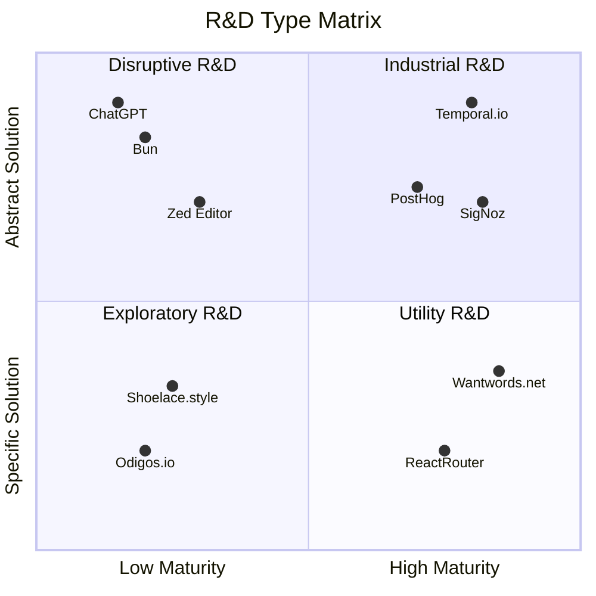

# 软件项目怎么做好技术方案选型?

## 前言

在研发项目技术设计阶段时，经常会遇到意见冲突。有人说“问题紧急程度高，我们要用最快的方式解决问题”；有人说“我们不能直接做，要把需求再抽象一下，这样有很多长期收益”；有的人说“现在用的技术框架XXX太落后了，最近新出来的XXX很适合我们的场景”；有人说“不要折腾了，新东西一定会踩坑，我们用成熟技术来做”......

团队成员多样性越强、决策过程越民主，这类争论持续时间越长。而项目初期的所有决策，都会深刻影响整个项目生命周期，一旦选型错了，很容易让项目方向陷入lock-in，**错误的设计想丢丢不掉、想换换不掉**，因此，技术方案的科学决策尤为重要。

## 软件设计中的两类争论

这些年做项目的过程中发现，技术方案的争论点主要在两个方面，分别是**抽象层次**和**技术成熟度**。

### 抽象层次争论：要不要再抽象一下?

一种争论是**抽象层次的理解不一致**，具体的问题抛过来，只看这一个问题开发呢？还是把问题上下文中涉及的名词和动词泛化，抽象成更高层次的概念，用更高抽象层次的概念，解决更多同类问题呢？

举个例子，我们团队负责的DevOps平台曾有个需求是这样的：产线服务需要部署一个“Dogfood”环境，为了让所有业务线产品的更新，都能让公司内部员工先使用，即“吃自己的狗粮”，确保没问题再推向外部市场，并且这个环境中需要**最小化流程负担，让开发能够快速发布**。

如果不增加抽象层次，直接设计会怎么样呢？从数据库实体关系的设计看，数据库增加一张叫做“dogfood_release”的表，里面有状态字段实现定制流程。这个方案是100%匹配原始需求的，也是开发起来最快的方案。

如果增加一层抽象会怎么样呢？当时我的第一反应是，这个词叫“Dogfood”还是别的什么名字无所谓，需求本质上是：**在一个特殊的、风险可控的产线环境里，实现近乎全自动化的发布**。我们在现存的"release"概念基础上进行扩展，抽象出一个Auto Release Rule概念，让定制的流程能配置化，到时候给需要的应用启用这种叫“Dogfood Release”的Auto Release Rule即可。

可以看到，两种思路最终给用户呈现的功能几乎相同，但背后的技术方案截然不同。选哪一种更好呢？看完自然就有了答案。

### 技术成熟度争论：要不要试试新技术？

技术决策的另一种典型争论是：“**要不要选用XXX技术**”。

2015年我在一家外企实习过一段时间，那家公司对新技术很开放，一些项目甚至用了Scala, Node.js这类当时还很小众的技术。他们对新技术的热情深深影响了我，随后几年我在业余时间都在学新东西, TypeScript、Golang、Kubernetes等等，甚至一度认为，新的就是好的。

辗转到了现在的公司，第一个挑战是解决一个复杂Node.js服务的稳定性问题。那会是2018年，我认为的Node.js已经非常成熟了，问题在于业务而不是技术，但很多人都认为Node.js仍然太新了、不稳定，哪怕我和另外两位同事，已经花了半年时间修复了所有稳定性问题，但随后几年还是被“更成熟的”Java给重写了。

当然，不是简单的重写，大家看到了业务扩张和技术迭代的双重潜力，决心要干一票大的。

我们在Java生态里的技术选型相当激进，当时微服务刚火起来，采纳了SpringCloud Netflix全套微服务方案。然而，项目越做越不对劲，遇到了大量技术上的坑，比如服务发现数据一致性问题、HTTP2调用连接莫名其妙断开问题、Hystrix/Ribbon等组件被Netflix废弃问题、SpringCloud Stream和公司的消息队列SDK难以兼容、服务拆分过细导致的DevOps复杂度爆炸等等。

坑踩差不多了，团队也对SpringCloud的源码读的差不多了。如果再选一次，没有人会再选SpringCloud了，也不会再拆出来十几个微服务了。

这个故事的教训总结成两句话就是：

- **如果缺乏新技术的人才储备，成熟的技术对团队来说也是新技术**。
- **如果认为“大公司用过”的新技术就已经足够成熟了，那么一定会在这些“假想的成熟技术”上吃亏**。

近几年还有很多方案选择上的经验教训，这些经历彻底改变了我的技术观。**怎么客观定义“成熟的技术“，什么情况下可以选“新技术”**? 我们需要上升到理论高度来回答这些问题。

## 研发类型矩阵理论

上面我们用例子说明了两个维度的选择困境，一是**对问题的抽象层次**，二是**技术成熟度**。

我们把两个维度做成四象限，找些项目对号入座，就可以进行分类了：

X轴是所选用技术的成熟度，左边是不成熟的新技术，右边是大量案例验证的成熟技术。比如Web Components是一个新技术，在X轴左侧，React是一个成熟技术，在X轴右侧。

Y轴是所要解决问题的抽象程度，下面是只解决具体问题的方案，上面是通过高度抽象的模型解决一大类问题的方案。比如UI库就是非常具体的问题，在Y轴下面，而OpenAI想做出通用人工智能（AGI）解决一切问题，抽象层次已经在Y轴高到大气层了。

1. **第一象限：技术成熟度高，解决抽象问题**。除了之前介绍过的Temporal，还有一个我很喜欢的项目PostHog也一样，用的技术是React/AntD/Typescript这类非常成熟的技术，但解决的问题范围巨大，想要成为Product OS，解决一切PM相关问题。这些项目像是久经沙场的将军，步步为营，却暗藏巨大的野心，我们将其称为**工业型研发**（Industrial R&D）
2. **第二象限：技术成熟度低，解决抽象问题**。比如前不久爆火的Bun，用的是Zig这样一个想要取代C语言的新兴编程语言，但目前版本稳定性欠佳，叫好不叫座。OpenAI做的事情更不用说了，抽象程度和技术新颖度已经超出了大多数开发者的认知。落在这个象限的大都是颠覆性项目，我们将其成为“**颠覆性研发**”（Disruptive R&D）
3. **第三象限：技术成熟度低，解决具象问题**。图中举了两个例子，一个是用eBPF解决Tracing问题的Odigos，另一个是用Web Component、最新Web标准的UI库Showlace。这个象限可以叫“**探索型研发**”（Exploratory R&D）
4. **第四象限：技术成熟度高，解决具象问题**。比如我经常用的[反向词典WantWords](https://wantwords.net/)工具，看[源码](https://github.com/thunlp/WantWords)，技术和算法很普通，但近反义词查询这个具体问题解决的很好。这个象限的项目我们称之为“**工具型研发**”（Utility R&D）

归纳完研发类型后，我们做一个反向因果的假设：**因为定位成某种类型的项目，所以方案选择必须落在该象限**。再找些失败的案例，可以发现这几类问题：

- 要想做**颠覆型研发**，只靠成熟技术的组合，或是只解决具体问题，都达不到颠覆效果；
- 要想做**工具型研发**，如果过度抽象，就会脱离原始需求；
- 要想做**探索型研发**，继续用现成技术，团队没法更新技术储备；
- 要想做**工业型研发**，追求新技术会给项目带来巨大风险。

一个不言而喻的结论浮出水面：**应该让项目自身的定位，来决定抽象层次和技术成熟度的选择**。**一旦实际选择与项目定位不匹配，就会出大问题**。结合其他变量，还能发现一个**推论**：从**右下角到左上角画一个箭头，越往左上角的第二象限，项目投入越高、风险越高、收益越高、对人能力要求越高**。

带着这个**研发类型矩阵**理论，我们再回到上一节的问题。

第一个问题是：**抽象到什么程度是恰到好处的**？

回答这个问题要回到项目的原始需求：是要做颠覆性的大事情，还是做风险可控的商业项目？是空闲时间随意的探索，还是一个迫切需要的底层工具？

项目定位确定了，抽象程度就很容易把控了。做小项目，小工具的时候，要警惕**过度抽象**，别想太多，对照原始需求做就完了；做大项目的时候，既要警惕[**思维惰性**](https://en.wikipedia.org/wiki/Lazy_user_model)，选短期工作量最小的方式，也要抵制高抽象层次的诱惑，毕竟**抽象的代价是忽略细节，而很多业务系统，核心价值就在细节中**。这几年冒出来很多低代码平台，大部分是对问题过度抽象了，想造一层“银弹”出来解决所有业务问题，把工业型研发臆想成颠覆型研发，项目定位就错了。

第二个问题是：**什么情况下能用新技术**？

上节的故事有个蹊跷的地方：既然决定了用“成熟的Java”重构那个业务，为什么选了个Java生态里，当时并不成熟的Spring Cloud呢？

《How Big things get done》一书中，也描述了这个有意思的现象：**越大的工程项目，越倾向于用新技术**。随之也描述了一个残酷的事实：**追求新技术恰恰是一些大型项目失败的主要因素**。

[创新扩散理论](https://en.wikipedia.org/wiki/Diffusion_of_innovations)告诉我们的，**一群创新者会倾向于采纳另一群创新者的成果**。但这不能完全解释，为什么大项目中创新扩散往往会**加速**。我比较信服的一种解释是：优秀的工程师会一直学新东西，这些人通常也是团队骨干、意见领袖(KOL)。大项目出现时，往往聚集了组织最优秀的人才和创新者，这群人跃跃欲试，想着怎么引入厉害的技术，在大项目中大干一番，因此大项目上马新技术的现象更明显。

我们理性思考一下，大项目风险本来就高，再乘以不稳定的新技术带来的风险，显然不是第一象限“**工业型研发**”该有的样子，而是第二象限的**颠覆性研发**。如果真的是第二象限的项目，需要卓越的**见识、魄力、智力**才能做。悉尼歌剧院成名的背后，是新技术和奇思妙想导致的1400%项目预算超支，毁掉了天才设计师乌松的整个职业生涯；ChatGPT单月增长一亿用户的背后，埋葬的是60多年来三波AI浪潮中，无数死掉的项目。

很多有想法的工程师，理想中是在第二象限做“**颠覆性研发**”，现实中是在**第一象限和第四象限**当将军和士兵。**大部分大项目就属于第一象限**，用商业公司的钱，做多数人能**看得懂，用得着**的软件，**没有充分的评估和使用经验就引入不成熟的新技术，是不负责任且不可取的**。

然而，只做第一象限的项目，很难提升个人和团队的技术力。微软CEO纳德拉说：“Our industry respects innovation, not tradition”。我的对策是：在主线项目之余，寻找或者创造做第三象限**探索型研发**的机会，把大家还认为**不成熟的技术，多用多练，转化为成熟技术**。

**一三象限相结合，不断提升问题抽象能力和对新技术的运用能力**，那么第二象限有机会也可以去够一够了。举个例子，我们团队成员曾尝试用Rust语言重构项目底层一部分功能，效果很好，即使公司其他团队还认为Rust太新不敢用，我们也认为Rust是成熟技术了；而Service Mesh领域火爆的Istio，我们四年前开始评估、实验，但实际效果达不到预期，现在仍然将其定位为不成熟技术。

一句话总结现在我对新技术的态度：**看的要多，学的要快，采纳要慢**。

## 引申思考

我们给研发矩阵加上动态发展的视角，还能得到一些有趣的启发。

### X轴 - 重构

X轴的变化，就是把项目的代码实现，换成新技术/旧技术，仍然是和原先类似的架构设计。有两种情况会在X轴改变项目定位：

1. 项目遇到技术挑战，当前方案要么用的技术太新遇到解决不了的坑，或者技术太旧实现不了某些需求。这种情况换技术方案是有价值的，谨慎评估，快速行动即可。
2. 团队人员发生变化，技术栈不匹配。遇到的好几个Node.js项目被用更旧的Java重写，都是因为新接手的团队不会Node.js。**这种情况对最终用户没有产生任何价值**，如果是用新技术换掉过时技术可以理解，如果是反过来，只是为了统一团队技术栈放弃了新技术，明显是得不偿失的事情。

### Y轴 - 跃迁

Y轴的变化，就是整个软件的领域模型设计变了，增加或者减少了用到的抽象概念。常见的情况是范围扩大，比如从工具转为平台。由于资源限制，很多软件项目起步的时候定位就是一个工具，成功后往往会向平台级产品发展。Vercel和Hashicorp两家公司是典型的例子，做工具型研发非常成功，知名度起来后，都转向做平台级产品，讲大故事。

Y轴的变化通常是**决定生死**的，最好是在早期就用MinMax思维考虑发展路径，把问题域的底限和上限想明白，否则很容易盲目扩张到进退两难的境地。Hashicorp是一个典型的例子，两位创始人最开始只是做一些分布式系统的底层工具，Terraform、Consul、Vault这些工具迅速流行，给了Hashicorp发展成云平台的机会。然而这家看起来很成功的上市公司危机四伏，平台做的一塌糊涂，财报看不到盈利的希望，市值跌去超过80%。我在工作中也犯过类似的错误，想靠一个看起来完美的模型，统一解决所有类似的问题，忽略了**生态**、忽略了**市场**，忽略了产品的生存之本--**用户价值**，怎么可能只靠提升抽象层次实现**工具到平台**的跃迁呢？

## 总结

我们从两类意见冲突的场景出发，归纳了**研发类型矩阵**：第一象限是**工业型研发**；第二象限是**颠覆型研发**；第三象限是**探索型研发**；第四象限是**工具型研发**。然后，我们又从模型中发现了“**项目定位决定抽象程度和技术选型**”这个深层规律，以及两个坐标轴变量与**项目投入、风险、收益、人员能力要求**的关系。我们也通过例子来说明了怎么运用这些规律，怎么通过一三象限项目搭配，持续磨炼工程能力。

最后，我们带上时间维度，思考了项目演化过程中，改变研发类型的场景和结果：**换技术选型分高下，改抽象层次定生死**。
