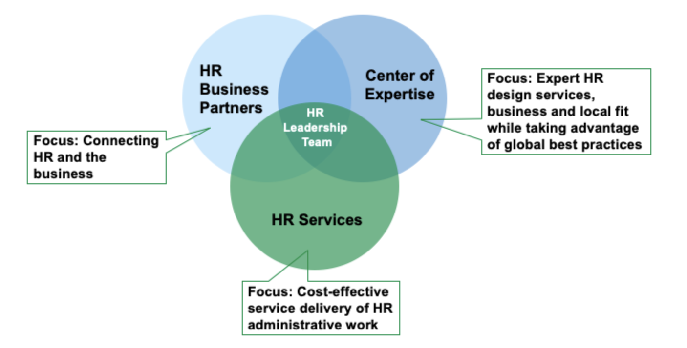

### SaaS的理解

Software as a service

SaaS is Subscription ? No, it's one typical form, and the best pricing strategy that matches the value creation
SaaS is software reused on the cloud ? No, it could be client software, like IDE. Major form is cloud + web or cloud + client/mobile-app, could be pure client side. Need data send to cloud side, no matter through API or custom support or telemetry- CoE side.

SaaS is self-service way to create user value.
Software encapsulate the experience & abstracted model, exposed as self-service portal
Human that communicates with customer won't serve by default, only handle new cases or risky cases that system can not handle automatically, act as the BP, feedback to Human that maintain the software to evolve the model.

Scalable Capability 模型: CoE - BP - SSP

SaaS 创造的价值，从外部看：
软件定义能力，固化在产品中的经验和能力带来的高起点；
软件定义资源，共享的底层资源带来的超低成本；
能力固化+资源云化，也意味着企业的风险转移。

从内部看
三支柱中的角色的工作，构成了一个创造价值的动态过程，即价值链。

【对SaaS企业内部角色的分类】

以购买软件而非直接雇佣的形式，获得企业运营所依赖的各项能力，转移风险。

Centralized and scalable way to balance between operation risk and innovation speed.
- Centralized expertise, scalable service, and the bridge to connect them

HR Structure
CoE (Center of expertise) + BP (Business Partner) + SSC (shared service center).

For infrastructure layer, it could be:
● Infra CoE -> Experienced SRE team (Now ZCP committee involved teams)
● Infra BP -> App Ops/SRE teams of each product or business
● Infra SSC -> The ZCP product, the automated self-service for DevOps stakeholders.

SaaS的本质：**一种由领域专家构建的、持续迭代的、能够让用户自助服务的软件系统**。